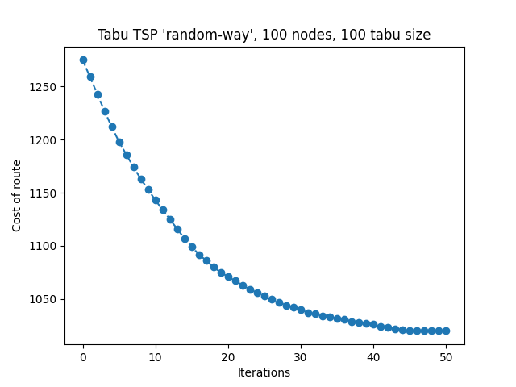

# About it 

In this project, i am using Tabo search algorithm for solve Travel Salesman Problem.
For TSP was written generator. And you also can see demonstration of work at [presentation](https://github.com/Asthera/Tabo-Search-Algorithm/blob/main/Tabu%20search.pptx "Opens Tabu search.pptx").

## How to run ?

Just run [main file](https://github.com/Asthera/Tabo-Search-Algorithm/blob/main/main.py "Opens main.py").

## Results

##

##

##

##

##

##

